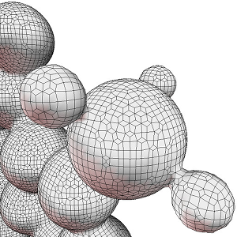

# Introduction
This project provides a simple C++ implementation of the dual marching cubes
algorithm described in the paper
[Dual Marching Cubes](https://dl.acm.org/citation.cfm?id=1034484)
from Gregory M. Nielson.
It is a byproduct of some work I did as a student assistent back in 2009.
Though there are other implementations out there it might still be helpfull
to someone.

# Requirements
* C++11
* No other dependencies

# Implementation
The algorithm is implemented in the files `dualmc.h`, `dualmc.tpp`,
and `dualmc_table.tpp`. A simple example command-line application which demonstrates
basic usage is provided as well. An application for generating the dual marching
cubes table is implemented in `gentable.cpp`.

Dual point computation could be improved using Hermite data or at least first
derivatives as described in [Dual Contouring of Hermite Data](https://dl.acm.org/citation.cfm?id=566586).
So feel free to contribute :)

# Example Application
To build the example and see the available options in a Linux environment type:

    $ make
    $ ./dmc -help

For Windows or OS X the adept programmer should have no problems setting up
a small project.

## RAW Files
The example application can only read 8-bit and 16-bit volume data sets in the
very limited *RAW* format (i.e. only stores raw data, no further information such
as the volume grid dimension is included).
A classic source for RAW files is http://www.volvis.org/ . Currently, the site
does not seem to be available.
The [OpenQVis](http://openqvis.sourceforge.net/index.html) project also provides some
data sets in RAW format.
Another source is [The Volume Library](http://www9.informatik.uni-erlangen.de/External/vollib/)
from Stefan Roettger. This site provides files in the more versatile *PMV* format
but also code which can convert these files to RAW.

The example application provides a small cube data set (32^3)and can also generate a
caffeine molecule.
To extract a surface from the cube volume type:

    $ ./dmc -raw data/cube.raw 32 32 32 -iso 0.5

The iso value of 0.5 is mapped to a middle density w.r.t. the bit-depth of the data set.
For the caffeine data set type:

    $ ./dmc -caffeine -iso 0.5

For code simplicity the example outputs surfaces in the
[Wavefront OBJ](http://www.fileformat.info/format/wavefrontobj/egff.htm)
format.

# License
[BSD 3-Clause License](LICENSE)
